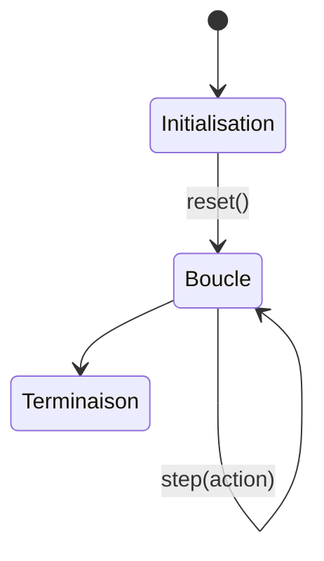
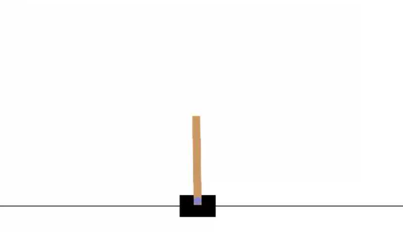
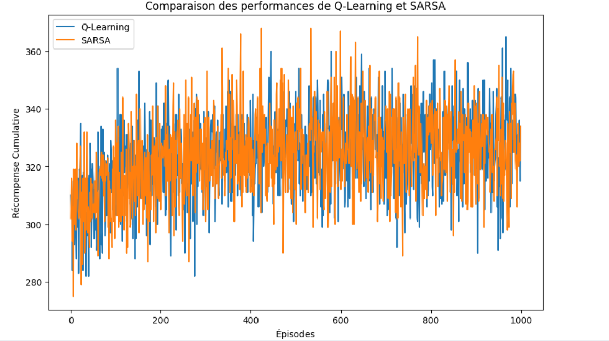

# Reinforcement Learning 


Le Reinforcement Learning (Apprentissage par Renforcement) est une branche du Machine Learning où un agent apprend à interagir avec un environnement pour maximiser une récompense cumulée. Ce dépôt explore les concepts clés à travers des TP pratiques utilisant OpenAI Gym, Q-Learning, SARSA et PPO.

Ce dépôt contient les travaux pratiques de Machine Learning II sur l'apprentissage par renforcement, réalisés dans le cadre du cours à l'École Nationale de l'Intelligence Artificielle et du Digital.

## 📋 Table des matières
- [TP1: Découverte d'OpenAI Gym](#tp1-découverte-dopenai-gym)
- [TP2: Algorithmes de Base (Q-Learning/SARSA)](#tp2-algorithmes-de-base-q-learningsarsa)
- [TP3 - Optimisation des Feux de Circulation par Reinforcement Learning](#tp3---optimisation-des-feux-de-circulation-par-reinforcement-learning)
- [TP4 - Proximal Policy Optimization (PPO)](#tp4---proximal-policy-optimization-ppo)
- [Guide d'installation](#guide-dinstallation)

## TP1: Découverte d'OpenAI Gym

### 🎯 Objectif
Prendre en main les environnements Gym et les concepts de base du Reinforcement Learning (RL).

### 📖 Définition et Rôle d'OpenAI Gym
**OpenAI Gym** est une boîte à outils standardisée pour le développement et la comparaison d'algorithmes d'apprentissage par renforcement. Son rôle principal comprend :

1. **Standardisation** :
   - Fournit une interface commune pour tous les environnements (méthodes `reset()`, `step()`)
   - Permet des comparaisons équitables entre algorithmes

2. **Bibliothèque d'environnements** :
   - Environnements classiques (CartPole, MountainCar)
   - Environnements Atari (Jeux vidéo)
   - Environnements 2D/3D de physique (MuJoCo)

3. **Outils d'évaluation** :
   - Métriques standardisées (récompense cumulée, durée des épisodes)
   - Capacité d'enregistrement des résultats

4. **Flexibilité** :
   - Prise en charge de la création d'environnements personnalisés
   - Compatibilité avec PyTorch et TensorFlow

### Fonctionnement de Base
Le flux typique d'interaction avec Gym suit ce schéma :



## Implémentation Gymnasium - CartPole

### 1. Importation et Configuration

```python
import gymnasium as gym
env = gym.make("CartPole-v1", render_mode="human")
```

**CartPole-v1**: Environnement classique de contrôle
**render_mode="human"** : Active la visualisation


```python
import gymnasium as gym
```

### 2. Création de l'environnement
```python
env = gym.make("CartPole-v1", render_mode="human")  # Mode "human" pour la visualisation
```
### 3. Initialisation
```python
observation, info = env.reset()  # Réinitialise l'environnement et retourne l'état initial
print("État initial:", observation)
```

### 4. Exploration des propriétés
```python
print("\nPropriétés de l'environnement:")
print("- Espace d'actions:", env.action_space)       # Discrete(2) → 0=gauche, 1=droite
print("- Espace d'observations:", env.observation_space)  # Box(4,) → [position, vitesse, angle, vitesse angulaire]
```

### 5. Exécution d'épisodes aléatoires
```python
for episode in range(3):  # 3 épisodes de démonstration
    observation = env.reset()[0]
    done = False
    total_reward = 0
    
    while not done:
        # A. Rendu visuel
        env.render()  
        
        # B. Sélection d'action aléatoire
        action = env.action_space.sample()  
        
        # C. Exécution de l'action
        observation, reward, terminated, truncated, info = env.step(action)
        
        # D. Gestion de la terminaison
        done = terminated or truncated
        total_reward += reward
        
    print(f"\nÉpisode {episode+1}:")
    print("- Récompense totale:", total_reward)
    print("- Dernier état:", observation)
```

### 6. Fermeture propre
```python
env.close()
````


[](1.mp4)  

👉 *Cliquez sur l'image ci-dessus pour voir la vidéo !*


## TP2: Algorithmes de Base (Q-Learning/SARSA)

### 🎯 Objectifs
1. Implémenter les algorithmes fondamentaux du RL tabulaire
2. Comparer Q-Learning (off-policy) et SARSA (on-policy)
3. Analyser les politiques apprises
  

### 📚 Théorie Clé
| Algorithme   | Type       | Mise à jour                                                                 | Exploration |
|--------------|------------|-----------------------------------------------------------------------------|-------------|
| **Q-Learning** | Off-policy | `Q(s,a) ← Q(s,a) + α[r + γ maxₐ Q(s',a') - Q(s,a)]`                        | ε-greedy    |
| **SARSA**      | On-policy  | `Q(s,a) ← Q(s,a) + α[r + γ Q(s',a') - Q(s,a)]`                             | ε-greedy    |

---

## 1. Q-Learning (Off-Policy)

### Principe Fondamental
**Apprend la politique optimale** indépendamment des actions effectivement choisies pendant l'apprentissage.

#### Pseudocode
```python
Initialiser Q-table arbitrairement
Pour chaque épisode :
    s = état initial
    Tant que non terminal :
        Choisir a via ε-greedy(Q,s)
        Exécuter a, observer r, s'
        Q(s,a) += α[r + γ maxₐ Q(s',a') - Q(s,a)]
        s = s'

```

## Implémentation Q-Learning

### 1. Initialisation
```python
import numpy as np

# Hyperparamètres
alpha = 0.1  # Taux d'apprentissage
gamma = 0.99  # Facteur de discount
epsilon = 0.1  # Exploration
episodes = 1000

# Q-table (états × actions)
q_table = np.zeros((state_size, action_size))
```
### 2. Boucle d'Apprentissage
```python

for episode in range(episodes):
    state = env.reset()[0]
    done = False
    
    while not done:
        # Sélection d'action ε-greedy
        if np.random.random() < epsilon:
            action = env.action_space.sample()
        else:
            action = np.argmax(q_table[state])
        
        # Exécution
        next_state, reward, terminated, truncated, _ = env.step(action)
        done = terminated or truncated
        
        # Mise à jour Q-learning
        best_next = np.max(q_table[next_state])
        q_table[state, action] += alpha * (reward + gamma * best_next - q_table[state, action])
        
        state = next_state
```
## Implémentation SARSA

### 1. Initialisation (identique à Q-learning)
### 2. Boucle d'Apprentissage
```python
for episode in range(episodes):
    state = env.reset()[0]
    done = False
    
    # Sélection initiale d'action
    if np.random.random() < epsilon:
        action = env.action_space.sample()
    else:
        action = np.argmax(q_table[state])
    
    while not done:
        # Exécution
        next_state, reward, terminated, truncated, _ = env.step(action)
        done = terminated or truncated
        
        # Sélection de la prochaine action (SARSA)
        if np.random.random() < epsilon:
            next_action = env.action_space.sample()
        else:
            next_action = np.argmax(q_table[next_state])
        
        # Mise à jour SARSA
        q_table[state, action] += alpha * (reward + gamma * q_table[next_state, next_action] - q_table[state, action])
        
        state, action = next_state, next_action
```

## TP3 - Optimisation des Feux de Circulation par Reinforcement Learning

### 📚 Objectifs
- **Comprendre** un environnement de contrôle urbain complexe
- **Adapter** les algorithmes de RL à un problème concret
- **Analyser** l'impact des politiques apprises sur le trafic
## 🌐 Environnement `TrafficEnvironment`

### 🏗 Structure
```python
class TrafficEnvironment:
    def __init__(self):
        self.state = np.random.randint(0, 10, size=4)  # [Nord, Sud, Est, Ouest]
        self.current_light = 0  # 0: Vert NS, 1: Vert EW
```

### Caractéristiques Techniques

| Composant       | Type         | Valeurs                     | Description                     |
|-----------------|--------------|-----------------------------|---------------------------------|
| **État**        | `Box(4,)`    | [0-10] pour chaque direction| Nombre de véhicules en attente (Nord, Sud, Est, Ouest) |
| **Action**      | `Discrete(2)`| 0 ou 1                      | 0: Maintenir les feux actuels, 1: Changer les feux |
| **Récompense**  | `float`      | ≥0                         | Nombre de véhicules ayant traversé l'intersection |

### Dynamique du Système

1. **Passage des véhicules** :
   - Jusqu'à 4 véhicules peuvent passer par cycle sur la voie verte
   - Passage stochastique : `randint(1,5)` véhicules passent effectivement

2. **Arrivée de nouveaux véhicules** :
   ```python
   new_cars = np.random.randint(0, 3, size=4)  # Ajoute 0-2 véhicules par direction

# Comparaison des performances de Q-Learning et SARSA

## Résultats des algorithmes

L'analyse comparative entre Q-Learning et SARSA révèle les performances suivantes :

| Algorithme   | Récompense Cumulative Moyenne |
|--------------|-------------------------------|
| Q-Learning   | 327.77                        |
| SARSA        | 327.06                        |

## Visualisation des performances



### Observations :
- **Q-Learning** atteint une récompense cumulative plus élevée (327.77) que **SARSA** (327.06 ) après 1000 épisodes.
- Les deux algorithmes montrent une progression significative au cours des 200 premiers épisodes.

# TP4 - Proximal Policy Optimization (PPO)

## Objectifs
- Implémenter l'algorithme PPO pour optimiser une politique d'agent RL.
- Évaluer les performances sur un environnement spécifique avec des épisodes définis.
- Analyser l'impact du clipping et des avantages (_advantages_) sur la stabilité de l'apprentissage.

---

## Théorie Clé : Fonction de Perte PPO
La fonction de perte de PPO inclut un terme de clipping pour éviter des mises à jour trop grandes :  


$$L(\theta) = \mathbb{E}_t \left[ \min \left( r_t(\theta) A_t, \text{clip}(r_t(\theta), 1 - \epsilon, 1 + \epsilon) A_t \right) \right]$$


Où :
- $$r_t(\theta) = \frac{\pi_\theta(a_t|s_t)}{\pi_{\theta_\text{old}}(a_t|s_t)}$$ (ratio des politiques)
- $$A_t$$ : Estimation de l'avantage
- $$\epsilon$$ : Paramètre de clipping (ex: 0.2)

## Guide d'installation

1. **Environnements de base** :
```bash
pip install --upgrade gymnasium pygame numpy
```
```bash
# Cloner le dépôt
git clone https://github.com/Maryam-ELALAMI/reinforcement-learning.git
cd reinforcement-learning
